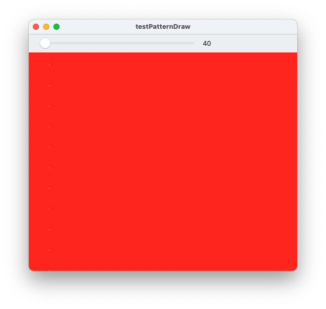

# testPatternDraw

A demo to show CGContextSetFillPattern glitch on Ventura.

If the size of the pattern is a multiple of 4, there will be a hole in the upper right corner of the pattern in the first column.

